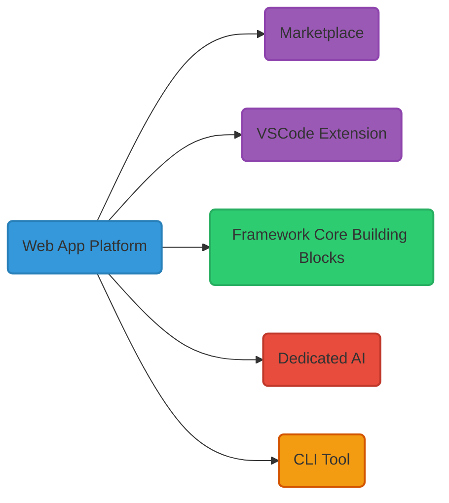
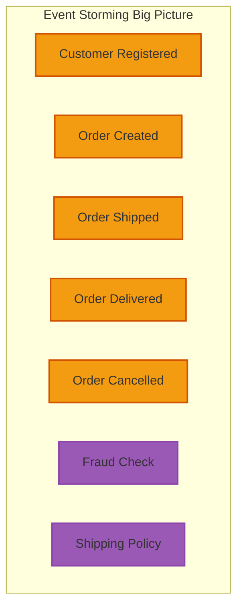
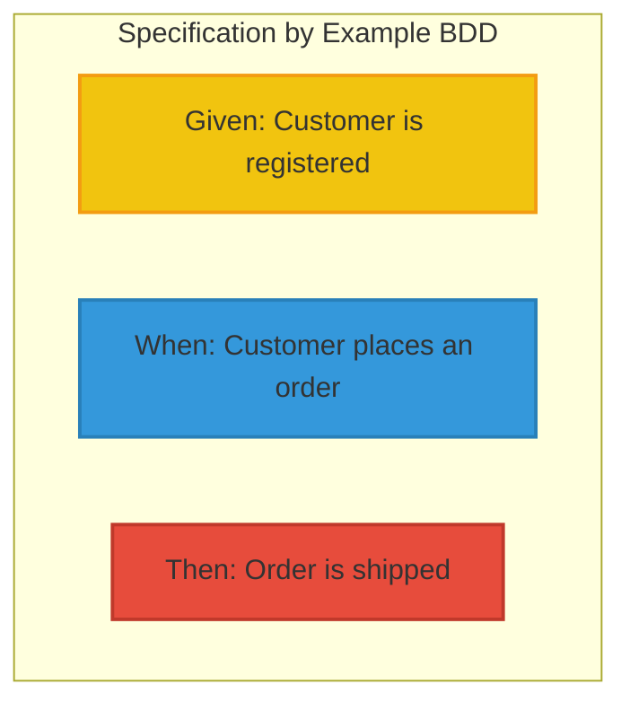
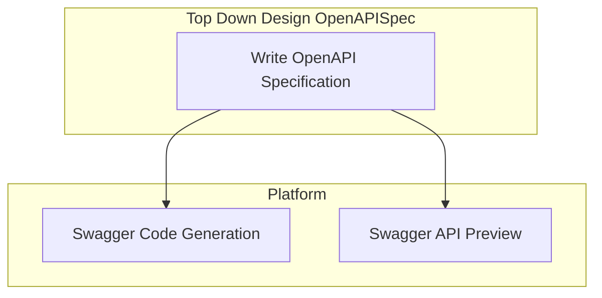

# DynamicSoft

## Table of contents

[1. Introduction](#1-Introduction)

## 1. Introduction

Small and medium-sized businesses (SMBs) encounter a myriad of challenges when navigating the complexities of modernizing their operations and undergoing cloud transformation. 

The dilemma lies in integrating existing solutions with the desire to build new ones from scratch. 
Striking a balance between maintaining legacy systems and embracing cutting-edge technologies poses a unique paradox for these businesses. 
To address this challenge, DynamicSoft platform emerges as a solution. 

This platform offers a marketplace featuring pre-built projects that are ready to be configured and deployed instantly. 
Moreover, it provides businesses with the flexibility to request custom development, ensuring that their specific needs are met in a seamless and efficient manner.

## 2. Solution Overview

The solution aims to provide a comprehensive and integrated platform that empowers developers, architects,
and teams to streamline their software development workflows, enhance collaboration, and accelerate project delivery.
At the core of our solution is a modular monolithic architecture, chosen for its balance of simplicity, scalability,
and maintainability.  
While microservices architectures offer benefits in terms of flexibility and scalability,
they also introduce complexity and operational overhead, which may not be necessary for all projects.
By opting for a modular monolithic architecture, we strike a pragmatic balance, enabling rapid development
and iteration while retaining the ability to modularize and scale components as needed.

First Law of Distributed Software: Don't Distribute ([Martin Fowler](https://martinfowler.com/articles/distributed-objects-microservices.html)):
Following the first law of software development, we prioritize simplicity and avoid premature distribution of components or services.
Distributing components prematurely can introduce unnecessary complexity and overhead,
hindering productivity and increasing the risk of system failures.

The solution is sort of integrated platform designed to provide a comprehensive development environment for building
and deploying software applications.
It encompasses several key components, including a Web App Platform, a marketplace for pre-build prototypes, 
specific Framework Building Blocks (Core, Abstraction, Code Generator), a dedicated AI with models trained on the solution's core code, 
a Visual Studio Code extension, and a command-line interface (CLI) tool.

## 3. Technical challenges, solutions & Trade-off
Here an overview detailing the technical challenges encountered, innovative solutions implemented,
and the trade-offs made during the project lifecycle, providing insights into the decision-making process and outcomes.

### 3-A. Architecture & Modeling:
#### Business Oriented VS Technical Design model:
Focusing on a business-oriented design model, such as Domain-Driven Design (DDD), rather than a technical design model
like Data or Entity diagram, enables alignment with business objectives and enhances scalability.  
By generating technical diagram models based on the business model, the platform streamlines development,
ensuring coherence between business requirements and technical implementation.

#### Combine Bottom-Up & Top-Down Design models:
Leveraging both bottom-up and top-down design approaches, enabling a holistic solution discovery process.
Bottom-up design focuses on problem-solving and meeting business acceptance criteria by starting with technical details
and gradually refining them to align with business objectives.   
Top-down design, on the other hand, begins with high-level business requirements and iteratively drills down
to technical implementation details.

By combining these approaches, the platform ensures comprehensive coverage of both business needs and technical feasibility,
resulting in effective problem-solving and solution delivery.

#### Collaboration & Version control:
The business-oriented model fosters collaboration across the entire team and business stakeholders
by providing a common language and understanding of domain concepts.  
This approach enables effective communication, encourages shared ownership of the solution,
and ensures that business goals drive technical decisions, resulting in a more cohesive and aligned development process.

By using a business model as the foundation, the platform can automatically generate technical models,
ensuring consistency and accuracy in translating business requirements into technical specifications.
This process streamlines development efforts, reduces manual errors, and provides a clear audit trail for tracking changes,
enhancing version control and collaboration among team members.

### 3-B. Evolution of Generation Model & migration
By employing JSON as the model persistence format, the platform enables seamless evolution of the model
and smooth migration of old existing models to new versions.  
JSON's flexibility allows for easy addition or modification of fields, making it conducive to accommodating
changes in the model over time.  
Additionally, its human-readable and lightweight nature simplifies debugging and troubleshooting.  
With JSON, the platform ensures compatibility and interoperability across different versions of the model,
facilitating efficient evolution and migration processes.

### 3-C. Code Generation:
Using template markup tools like Apache FreeMarker or Microsoft T4 text template will enable efficient code generation,
allowing developers to rapidly scaffold code based on predefined templates.  
Additionally, the integration of AI-driven code completion, review, and refactoring capabilities enhances
developer productivity and code quality.  
By leveraging AI algorithms, the platform provides intelligent suggestions, automates routine coding tasks,
and identifies potential code smells or optimizations, thereby streamlining the development process
and improving code maintainability.

### Supporting many architecture styles, patterns, platform languages & technologies.

## 4. Architecture & Modeling tool
The platform provide a comprehensive suite of modeling and diagramming tools, augmented by AI capabilities.
These tools empower teams to visualize complex systems, design intricate architectures, and map out intricate workflows with ease.
Leveraging AI assistance, the platform offers intelligent suggestions, automates repetitive tasks, and assists in decision-making processes.

Furthermore, the platform fosters enhanced collaboration among team members by facilitating real-time collaboration, version control, and feedback mechanisms.
Whether adopting a top-down or bottom-up approach to design, the platform provides robust support, enabling teams to iterate quickly, refine designs iteratively,
and align architectural decisions with business objectives effectively and normalize the code generation process.

### 4-A. Bottom Up Domain Modeling

### 4-B. Top Down APIs Modeling
Using APIs design first by writing the Open API Specification yml file and use tool like Swagger to preview the APIs and Swagger code generation to generate the APIs.

## 5. Dedicated AI for Design & Code Generation

The platform incorporates a dedicated AI system specifically tailored for design and code generation tasks.
This AI functionality serves as a powerful assistant to developers, architects, and designers, providing intelligent insights and automating repetitive tasks.
Users have the option to leverage both private and locally trained AI models, as well as publicly available AI services,
depending on their specific requirements and preferences.

Private and locally trained AI models offer several advantages, including enhanced privacy and security for sensitive data and projects.
By training AI models on proprietary datasets and project-specific contexts, users can fine-tune the AI's capabilities
to better align with their unique needs and domain-specific challenges.  
Additionally, local AI models provide greater control over the training process and enable users to iterate
and refine their models based on real-world feedback and insights.

## 6. Architecture Decisions Records